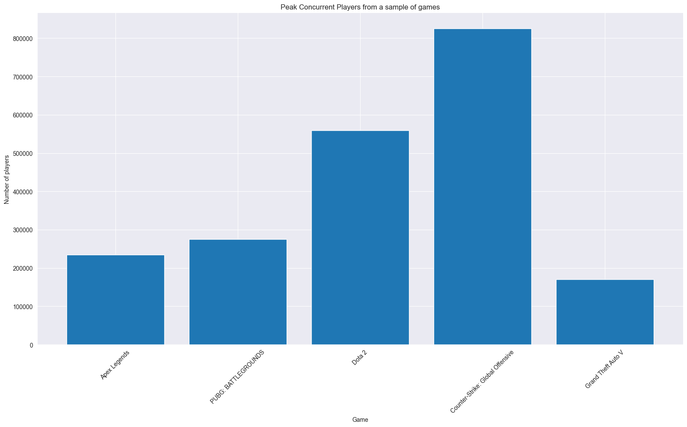
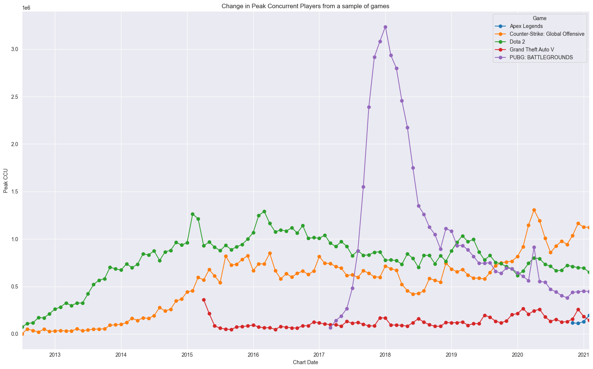

# Wrangle and Profile
Name: David Baumgartner  
StudentID: 11721765  

## Wrangle stage
My goal is to answer the question "How has the market for video games developed in recent years and what impact has the pandemic had on the market?". For that, I chose two data sets, Game releases and Game charts, which were described in the Discover stage. I will refer to these data sets with names "releases" and "charts" in the following tasks.

### Joining data sets
First, I loaded both data sets and checked for potential columns to merge them. Both data sets have a date column and a name (= video game name) column. The problem with the date columns is, that not only are both on different timespans, but more importantly, in releases the date is used as a date to indicate the release date and in charts it is used for showing when the data is gathered, which is gathered monthly not daily. So, I cannot use dates to merge, but the names seem very promising.  

Chart data only has 1260 unique games whereas releases has 71716. Leaving us with only 1260 merge-able game names. My naive approach was to merge both data sets by the name column. After the first merge, I ended up with only 941 unique games, meaning I lost a lot of information in the process. So, I checked which games did not merge. For that, I only printed a table with names and compared it to the releases video game names. After the investigation, I found a few problems in the way game names are stored in both data sets:
- usage of abbreviations: GOTY for Game Of The Year and also for game names like PUBG = PLAYERUNKNOWN'S BATTLEGROUNDS
- different symbols: ® and ™
- white spaces: one dataset cleaned some symbols and replaced them with white spaces
- non-Latin characters: The game releases set uses Chinese characters, while the game charts set has unicode in the names instead
- different naming in general: Names are essentially the same, with minor differences like 'Fall Guys: Ultimate Knockout' in charts and 'Fall Guys' in the releases data set
- multiple possible matches, due to slight differences in wording between the data sets

My approaches to solving this problem:
1. Remove special characters and whitespaces
2. Replace abbreviations (at least some of them)
3. Use best match on merge instead of the exact name, this allows rows to merge when one name is contained in the other

So, I created a new function to clean both name columns and merged the data sets again. My second approach yielded 1110 unique games. With the information that some games are just in one data set and not in the other, this result seemed good to me.  

### Data cleaning
My first step was to remove some column, which I considered to be not as useful after the merge. I only kept attributes, that helped me answer the research question.

After that I converted the dates into a nicer format. The release date was stored as `Aug 16, 2011` but I changed it to `2011-08-16`. For the frequently downloaded charts I had Year and Month as a column. To allow for better plotting, I converted introduced a new column 'Chart Date' which was constructed as a datetime from Year and Month in format `%Y-%m-%d`.

Then I checked for missing values in the data. Some columns had quit a few. I decided to drop values with NaN in column Categories, but replaced NaN values with 'None' in Genres, Tags and Publishers. For Gain I decided to set missing values to 0, since this value is a float number indicating if the peak player base in- or decreased to the previous month. So, I thought it would still be important to keep this rows instead of dropping them. Interpolation would also be an otpion instead of hard-coding these values, but these approaches would be very hard in a data set like this so I decided not look deeper into this.

The final step was to check the unique values in Categories and Genres because I believe the information in both of these columns showcase the behaviour of players very nicely. Categories should show how the game is playes, either alone or with others and Genres should tell what kind of game is playes, for instance RPG. I found that some values in both columns did not really indicate either the category or the genre, e.g. 'Steam Achievements' in Categories and 'Video Production' in Genres. So, i filtered for the most interesting values and removed the others from the data set.

### Data set quality
1. Number of available games before and after the merge

  

The plot shows how much information was lost due to the merging of both data sets. This does not mean, that there is too little data because we have multiple measures of average player count, peak and gain per year for each of these games. Of the possible merges almost 88% was preserved, which is still good considering the different ways to name video games in both data sets.

For the next plot, I choose a sample of games to showcase the difference before and after the merge.

2. Peak concurrent player count on release data set

NOTE: only the releases data set was used to get the visualization.

  

3. Peak concurrent player count over the years on merged data set

  

The third graph perfectly showcases why this merged dataset can give crucial insights into how the gaming market changed in recent years. The second plot, the bar plot, shows the same information, namely the peak number of concurrent players. The problem with the data in the releases dataset is, that there is no information when the peak of concurrent players was measured. Meaning, we cannot say when this peak occurred. With the new merged data set, we can now see a trend in concurrent players over the years, while still keeping the peak of the most concurrent player. So, we preserve the information from before and extend it for different months and years, which is very helpful for answering the research question.

## Profile stage

### Insight 1 - Most played games over the years

  

The plot shows the top 5 played games per year based on average (per month) concurrent users. Interestingly it is not the same games each year, which is to be expected but heavily depends if the game is played as a multi-player online or as a single-player. Some games only occur for one year, see 'Warframe' in 2018, or only for a few years and then are not in the Top 5 any more. This shows, that players are constantly looking for new games to play, but still, some titles stay consistently in the Top 5, see 'Dota 2'. The next plot has a deeper dive into the Top 5 categories, which might help to understand why some of these games stay on top. As expected 2020 has a spike for almost every game, this correlates to when the coronavirus pandemic struck across the globe. But still, 2019 seems to be the most gaming-intensive year - at least from what we can inspect in this data set.  

### Insight 2 - Most played categories over the years

 

The plot shows the top 5 played categories from games per year based on peak concurrent users. Every category has a steady increase in terms of peak concurrent users. Here, we see the highest spikes or highest increase to the previous year in the year of 2020. Again, showing the impact of the pandemic on the video game market, well at least on games on Steam and not the entire video game market. On top is Multi-player, which indicates that people in lockdowns had the desire to interact with friends more while being forced to stay at home. The best category to interact with friends is Multi-player and not Single-player or Local Co-op. That is why Multi-player saw a higher spike compared to Single-player.  

### Insight 3 - Game releases over the years per genre
Results are limited with release year after 2010. 

 

The graph indicates, that in most genres the most game released was in 2016. This could be due to the hype of video games and the rising popularity of esports or rather the acceptance of media, spreading more information about gaming than ever before (these are speculations). But, again, in 2020 was a spike in almost every genre, proofing that people had a rise in desire for new games and game publishers delivered. 

Since the line plot is relatively crowded the Top 3 genres for released games per year are also visualized. If more genres are shown, this means there were a few genres with the same number of released games.  

 

Unexpectedly, there is no big change in the game released per genre. This can indicate that the market has not really changed that much in recent years. It could also be, that the data set does not have enough information to make assumptions about the research question. Still, in 2020 was a small rise in game releases compared to the previous year for the genre 'Action' and 'RPG' has its first appearance in the Top 3.  

### Summary
Every graph showed a spike in 2020 for different characteristics (Peak or average concurrent player counts for games and categories). They also have the same fast decrease into a low in 2021. This can be due to less data in 2021 because the data set of the charts has January 2021 as the last month where these metrics are fetched. So, there is only one month of information in 2021. Another option would be to compare games based on monthly metrics instead of yearly metrics, this could yield slightly different results because data is not aggregated per year.  
