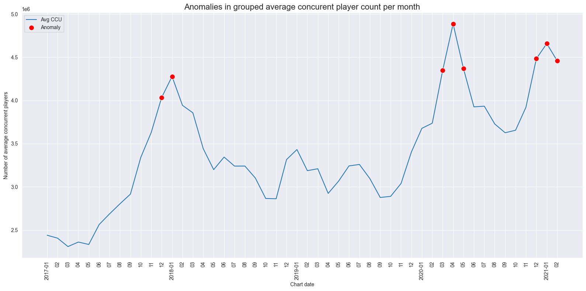
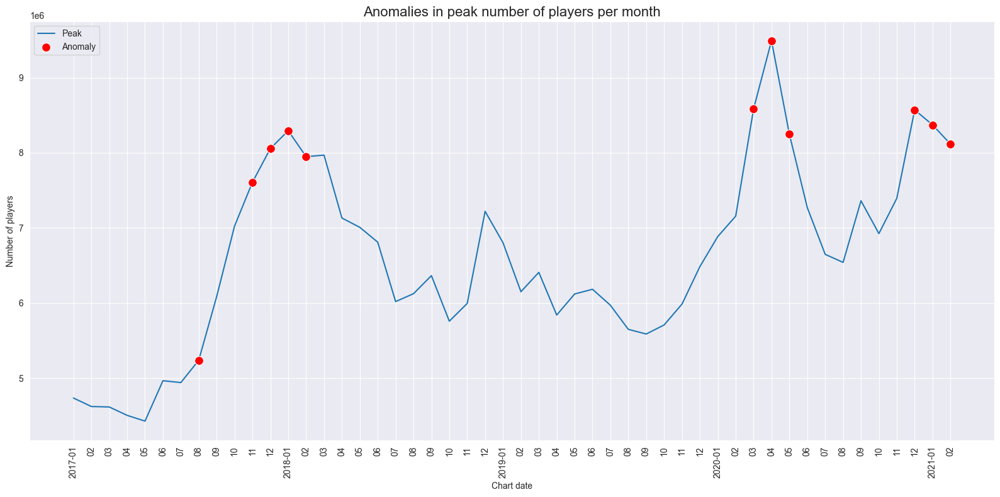
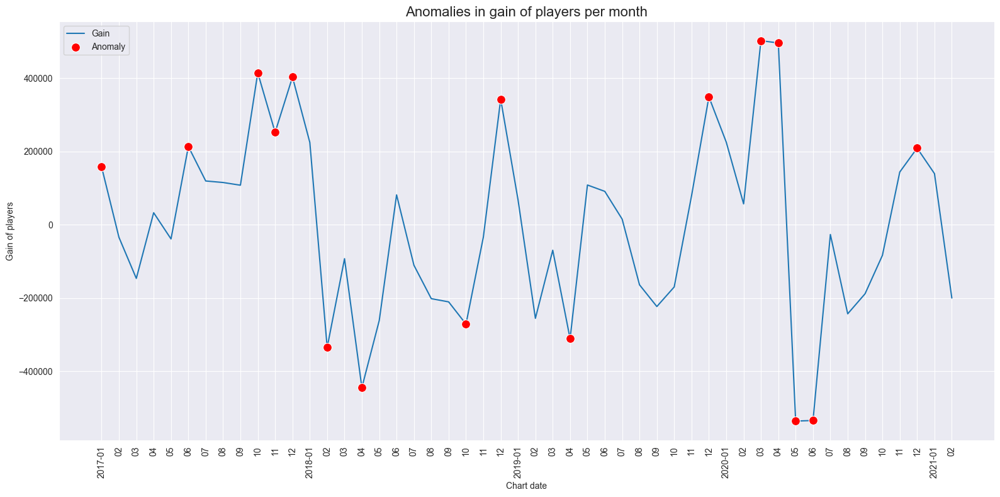

# Model
Name: David Baumgartner  
StudentID: 11721765  

## Description of modeling process
Research question: "How has the market for video games developed in recent years and what impact has the pandemic had on the market?"  

Possible modelling for the merged datasets and research question:
1. Regression: Do a prediction on 'Avg CCU' with important features like 'Categories', 'Genres', 'Price', 'Supported Languages', 'Platform', etc.
2. Clustering: Check for clusters in 'Peak' and plot 'Peak' (with clusters) vs. 'Chart date' -> Could answer if there is a difference in clusters over time
3. Anomaly detection: Find anomalies in chart data 'Avg CCU', 'Peak' and 'Gain' and plot against 'Chart date' -> Could show the influence of the pandemic on metrics

To answer the research question I choose anomaly detection on the metrics of the monthly chart variables, namely 'Avg CCU', 'Peak' and 'Gain'. I thought this approach could give great insights into how the pandemic impacted the gaming market. My hypothesis is, that the influence of the lockdowns can be seen as a noticeable increase in the number of players. These changes will most likely be detected as an anomaly from anomaly detection algorithms. So, the proof for the hypothesis would be the algorithm detecting a point as an anomaly where there was a lockdown. 

The merged dataset held a lot of information for every video game. So, before applying anomaly detection, the data had to be cleaned a bit. I applied the following steps before the detection phase:
- remove unnecessary columns, only keeping the important ones (metrics from the charts: 'Avg CCU', 'Peak', 'Gain' and 'Chart date')
- group the data on 'Chart date' and sum 'Avg CCU', 'Peak' and 'Gain' for every game
- remove chart dates before '2017-01-01'

Then as a final step, I applied anomaly detection with the 'IsolationForest' algorithm on every metric from the charts. The results indicate an anomaly with the value -1 and a normal value with 1.

## Visualization of anomalies
Anomalies in grouped 'Avg CCU' (= average concurent player count) per month  
  

Anomalies in 'Peak' number of players per month  
  

Anomalies in 'Gain' of players per month  
 

## Conclusion 
Lockdown dates in Austria:
1. March - April, 2020
2. November - December, 2020
3. December, 2020 - February, 2021

There are multiple anomalies for each graph even before the pandemic, marked because they show a high variance to their neighbour points. These points will not be discussed in detail because they are not part of the research question.  

Interestingly, every line plot clearly shows a spike and also anomaly points exactly for the months of the first lockdown. Also, later lockdowns are highlighted as anomalies in the plots. Only 'Gain' does not have anomalies in months from 2021. Another important insight from the 'Gain' graph are the anomalies in Mai and June in 2020. This makes perfect sense because in May the first lockdown ended. People were allowed to see their family and friends again and therefore stopped playing video games for this period. So, in concolusion the anomalies align almost perfectly with the lockdown dates and show that there is an impact on the gaming market.